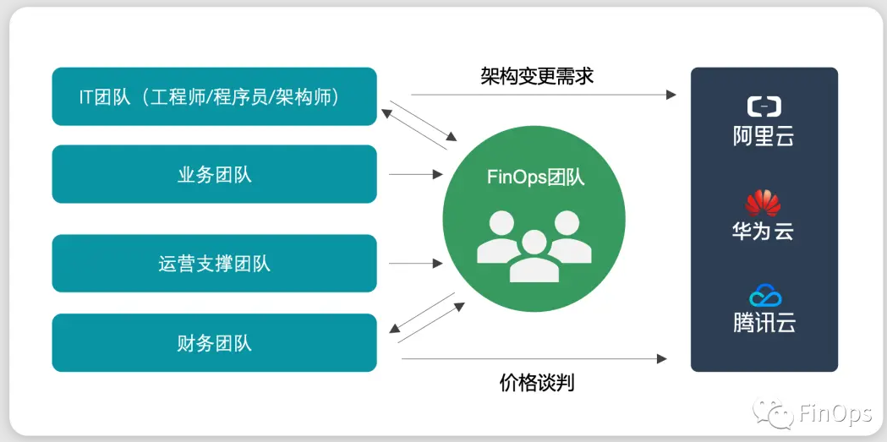

## 001 什么是FinOps

> 2018年，Linux基金会成立了FinOps基金会，致力于辅助企业通过流程和技术能力间射优化云上资源成本。
>
> 并作了如下定义：
>
> FinOps is the operating model for the cloud. FinOps enables a shift — a combination of systems, best practices and culture — to increase an organization’s ability to understand cloud costs and make tradeoffs. In the same way that DevOps revolutionized development by breaking down silos and increasing agility, FinOps increases the business value of cloud by bringing together technology, business and finance professionals with a new set of processes.

### Devops定义

> DevOps 通常是指新兴的专业运动，它倡导开发团队与IT运维团队协同共工作，从而实现在提高生产环境的可靠性，稳定性，弹性和安全性的同时，快速完成规划内工作（提高部署效率）的目的。

### FinOps定义

> FinOps 一词通常是指新兴的专业运动，它倡导DevOps和财务之间的协同合作，在提高“成本效率”，最终提升云环境盈利能力的同时，对基础架构支持进行迭代的、数据驱动型的管理（即提升云的单位经济性）。

FinOps 是将财务责任引入云的可变支出模型的实践，它使不同团队能够迅速在速度、成本和质量之间进行业务权衡。

具备了FinOps体系，每个运作团队（其中包括作业、服务、产品负责人）都可以获取它们需要的近实时数据，这不仅影响团队支持，而且有助于它们做出更合理的决策。

总的来说没FinOps的功能是排除障碍；授权于技术团队，以更快地发布更优质的功能、应用，或更快速地进行应用迁移；促进部门之间的沟通，包括投资偏向的实践和能力点。

### 实时报告

一个成功的FinOps实践包括三部分：

**实时报告 + 即时流程 + 团队协作 = FinOps实践**

实时报告的反馈闭环对人类行为有着很大的影响。根据我们的经验，你应该在工程师执行变更行为时，尽可能快速的给出反馈，让其了解这些行为可能产生的后果和影响。如此以来，各自的工作状态往往都会自动地往更好的方向发展。

实时数据驱动的决策支持，正是由FinOps提供的。

### FinOps的核心原则

- 团队需要协作。
  - 财务和技术团队几乎在同一时间一起工作，因为云时以时间、资源为单位运行的。
  - 团队之间协同工作，以不断提升效率和创新力。
- 云的业务价值驱动商业决策。
  - 相对于总支持，单位经济与价值指标更好地体现了业务影响。
  - 有意识地在成本、质量和速度之间做出权衡。
  - 将云视作创新的驱动力。
- 云资源开销，人人有责。
  - 资源使用责任和云成本责任被边缘化。
  - 独立的功能和产品团队有权在预算范围内决定各自的云资源用量。
  - 为资源使用和优化推行去中心化管理。
  - 技术团队必须将成本纳入新的效能指标的考核范围。
- FinOps 报告应保证可访问性和及时性。
  - 及时处理成本数据。
  - 可视化促进更优的云利用率。
  - 快速的反馈闭环有利于高效运转。
  - 为组织内各层次的团队提供一致的可视化云支出。
  - 创建、监控并改进实时财务预测和计划。
  - 趋势和差异分析有助于解释成本上升的原因。
  - 内部团队成本效能看板推动成本优化最佳实践，鼓励对先进团队和个人进行褒奖。
  - 同行业基准测试评估公司在所在行业的绩效水平。
- 集中式决策团队时驱动FinOps的必要条件。
  - FinOps的集中自动化减少了重复工作。
  - 管理层的理解及支持FinOps实践和流程时成功的必要条件。
  - 中心化的费率和折扣优化。
  - 集中管理并控制承诺使用折扣、预留实例，以及云提供商的批量或定制折扣的幅度。
  - 工程师和运营团队无需参与价格谈判，以便使他们能够专注于资源用量优化。
- 利用云计算的可变成本模型。
  - 云计算的可变成本模型应被视作机遇，而非风险。
  - 支持即时预测、规划并购买计算资源。
  - 相较于稳定的长期计划，多变的迭代计划更受欢迎。
  - 根据实际情况，对云资源用量 / 云优化进行持续的微调。

### 单位经济学

单位经济学时FinOps的重要概念之一，它将云支出和业务指标（总收入，出货量，付费用户，客户订单等）作比较，从而计算云资源投入产出比。

### 总结

- 应用FinOps需要公司内部所有团队之间的协作。
- 每个人都需要参与其中，成本意识不可或缺。
- FinOps的核心原则应作为云成本优化的所有流程的基础。
- 实时报告可衡量当前的支出与优化情况。
- 数据驱动的过程使公司具备成本效益的关键。
- 业务决策能够加快并匹配云资源决策的速度。

### 附网图

