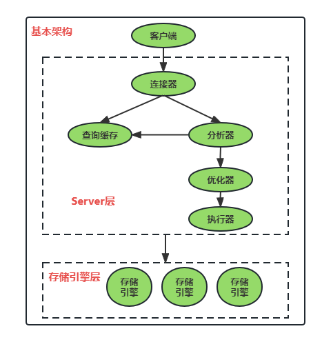

## 01|基础架构：一条SQL查询语句是如何执行的

### 基本架构示意图

```sql
-- 假设有个简单表中只有一个ID字段，执行该查询语句
mysql> select * from T where ID=10;
```



该图可以清楚的看到SQL语句在MySQL的各个功能模块中的执行过程，大体上分为Server层和存储层两部分。

- Server层：包括连接器，查询缓存，分析器，优化器，执行器等，涵盖MySQL大多数核心服务功能，以及内置函数（如日期，时间，数学，加密函数等）；
  - 连接器：管理接连，权限验证；
  - 查询缓存：命中则直接返回结果；
  - 分析器：词法分析，语法分析；
  - 优化器：生成执行计划，选择索引；
  - 执行器：操作引擎，返回结果；
- 存储引擎层：负责数据的存储和提取，支持innodb，MyISAM，Memory等多个存储引擎。目前常用innodb；

不同的存储引擎共用一个Server层。


### 连接器

> 连接管理，权限验证。
>
> - 建立连接之后，即使管理员对该用户权限做了修改，也不会影响已存在连接的权限，只能影响新建立的连接；

连接命令一般如下：

```SQL
-- 墙裂建议 -p 之后不接密码，回车之后再输入密码，避免密码泄露
mysql> mysql -h$host -P$port -u$user -p$passward 
```

正常情况下，连接器不会主动断开连接。客户端如果太长时间没动静，连接器就会自动将它断开，这个时间参数由`wait_timeout`控制，默认为8小时。**断开之后，客户端再发送请求则会失败，如果生产客户端没有做断线重连，会对生产有影响，所以，对于数据库而言，断线重连非常重要。**


### 查询缓存

> 命中则直接返回结果。
>
> 注：MySQL 8.0版本已彻底删除查询缓存功能。

MySQL拿到一个请求后，会先查询缓存，查看之前是否执行过这条语句，执行过的可能会以`key-value`对的行是被直接缓存再内存中。

如果语句不在缓存中，则会继续后面的执行阶段，执行完之后，再将查询结果存入查询缓存，这样能提高查询效率。

大多数情况下，不建议使用，因为往往弊大于利：缓存失效频繁。只要对一个表更新，这个表上所有的查询缓存都会被清空；

”按需使用“的方法为：

- 设置参数`query_cache_type`为DEMAND，默认不适用查询缓存；
- 使用SQL_CACHE显式指定，例如：

```SQL
mysql> select SQL_CACHE * from T where ID=10;
```


### 分析器

> 词法分析，语法分析。

- 先做词法分析。识别出SQL语句中的字符串是什么，代表什么，从而也能表是否存在，列是否存在等；
- 再做语法分析。根据词法分析结果，判断SQL是否满足MySQL语法；


### 优化器

> 生成执行计划，选择索引。

在SQL开始执行之前，需要先经过优化器的处理。

优化器在表里面存在多个索引时，负责决定使用哪个索引；或者在一个多表关联语句的时候，决定表的连接顺序（选择驱动表）。

选择更优的方案生成SQL的执行计划。


### 执行器

> 操作引擎，返回结果。

开始执行时，会先判断是否有表的查询权限，如果没有，则会返回没有权限的错误（如果命中缓存，会在缓存返回结果的时候做权限验证）。如果有权限，则根据优化器生成的执行计划打开表继续执行；以开篇的SQL为例，其执行流程如下：

1. 调用innoDB引擎接口取这个表的第一行，判断ID是不是10，如果不是则跳过，如果是则将这行存在结果集中；
2. 调用引擎接口”下一行“，重复1的判断逻辑，一直到最后一行；
3. 执行器将满足条件的行组成记录集作为结果集返回给客户端。


### 小结

MySQL基础架构，在执行一条查询语句的流程；

- Server层，包括连接器，查询缓存，分析器，优化器，执行器；
- 存储引擎层，负责数据的存储和提取，提供MySQL各种引擎的底层接口。


#### 问：如果表T中没有字段k，那执行 `select * from T where k=1;`肯定会报错，这个错误是在上面提到的哪个阶段报出来的？

答：分析器。分析器负责识别出SQL语句中的字符串是什么，代表什么，从而也能表是否存在，列是否存在等。

