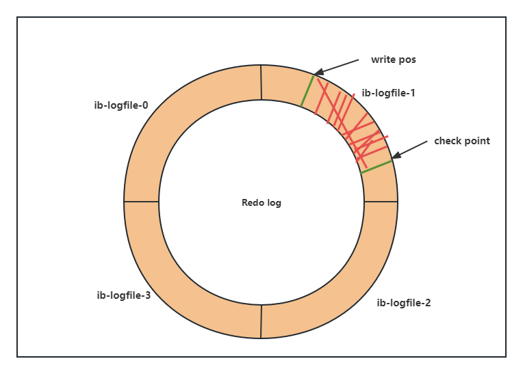
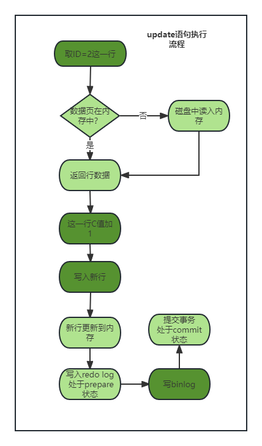
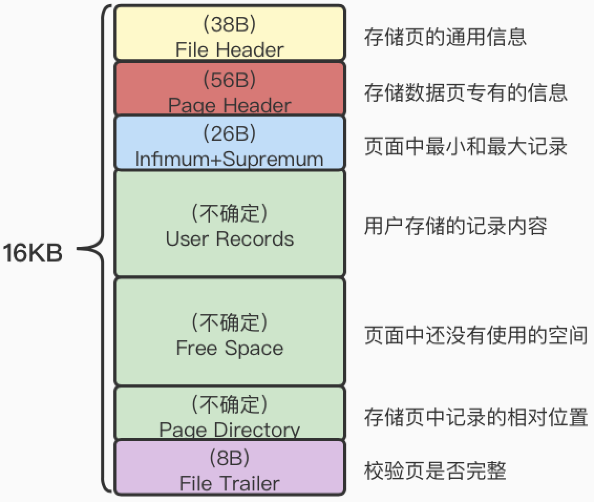
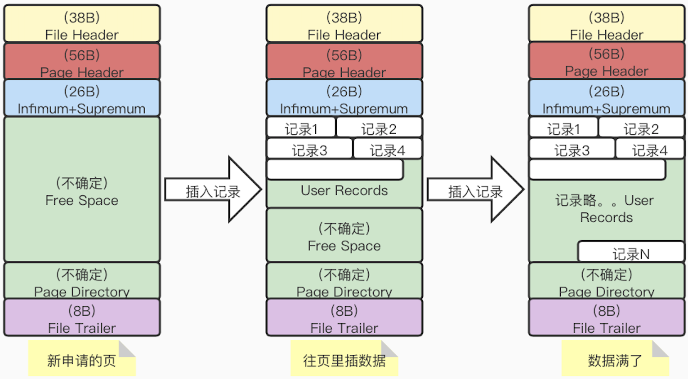

## 02|日志系统：一条SQL更新语句是如何执行的

示例表：

```SQL
create table T(
	ID int primarykey,
    c int
);
```

如果将ID=2这一行加1，SQL为：

```SQL
mysql> update T set c=c+1 where ID=2;
```

根据SQL语句的基本架构，更新语句也会走同样的流程。


与查询语句不一样的是，更新语句还涉及两个重要的日志模块：redo log（重做日志）和binlog（归档日志）。


### redo log

> **引擎层面，InnoDB特有的日志**
>
> 具体来说，当有一条记录需要更新的时候，InnoDB引擎会先把记录写进redo log里面，并更新内存，这个时候更新就算全部完成了。同时。InnoDB 引擎会在适当的时候将这个操作记录到硬盘里面。这个就是WAL技术，Write-Ahead Logging，先写日志，再写磁盘。

MySQL45把掌柜用粉板记账，等打样之后再把账本翻出来核算的方法来类比MySQL redo log的工作原理；其中粉板为redo log，账本为磁盘；

但当生意太好，粉板记账记满了怎么办？这个时候掌柜会将一部分记录给更新到账本中，然后把记录擦掉，腾出记账空间；

类似，InnoDB的redo log 为固定大小，比如可以配置4为一组4个文件，每个文件大小为1GB，那么这块“粉板”就可以记录4GB的操作。其为从头到尾的循环写，如下图：



其中，write pos是当前记录的位置，一边写一边往后移，写到3号文件末尾就回到0号文件开始的位置，如此循环。

write pos和check point 之间就是“粉板上空着的部位，用来记录更新的操作，如果write pos 追上check point，则表示”粉板“满了，要停下来擦掉一些记录，把check point往后推进一下。

由redo log来提供数据库异常重启，之前提交的数据数据不丢失能力，成为crash-safe。（根据”粉板“和”账本“上的数据，明确账目）


### binlog

> **Server层面的日志**
>
> binlog日志只能用来归档

binlog和redo log主要有以下三个不同点：

1. redo log为InnoDB特有的，引擎层面的日志；binlog为Server层日志，所有引擎都可以使用；
2. redo log为物理日志，记录的是在”某个数据页上做了什么修改“；binlog是逻辑日志，记录的是这个语句的原始逻辑；
3. redo log是循环写的，空间固定会用完；binlog为追加写入，文件一定大小后，切换到下一个文件继续写，不会覆盖前面的日志。

update语句的简单执行流程：

1. 执行器先取ID=2这一行，调用引擎接口。ID是主键，引擎搜索到这一行，如果ID=2这一行所在的数据页本来就在内存中，就直接返回给执行器；否则需要从先从磁盘读入内存，然后再返回；
2. 执行器拿到行数据，把这个值加上1，得到一行新的数据，再调用引擎接口写入这行新数据；
3. 引擎把新数据更新到内存中，同时将操作记录到redo log里，此时redo log处于prepare 状态，然后告知执行器完成了，随时可提交事务；
4. 执行器生成这个操作的binlog，并把binlog写入磁盘；
5. 执行器调用引擎的提交事务接口，引擎把刚刚写入的redo log改成commit状态，更新完成。



redo log 拆成两步，prepare和commit，这就是“两阶段提交”。


### 两阶段提交

问题：**怎么样让数据库恢复到半个月内任意一秒的状态?**

答：根据备份。可参考策略：先根据全量备份恢复，再利用binlog 追到需要的恢复的状态；

问题：**为什么需要”两阶段提交“？**

答：如果不使用的话，数据库的状态有可能和日志恢复出来库的状态不一致。比如update过程中突然crash

- 先写redo log，再写binlog。要是redo log执行完成，binlog未完成，binlog恢复不到现有数据库的状态；
- 先写binlog，再写redo log。binlog完成，redo log未完成，binlog恢复过头，与当前数据库状态不一致。

redo log和binlog都可以用户表示事务的提交状态，两阶段提交使得二者保持逻辑上一致。


### 小结

- redo log保证crash-safe能力，`innodb_flush_log_at_trx_commit`设置为1的时候，表示每次事务的redo log都直接持久化到磁盘。建议设置，保证MySQL异常重启之后数据不丢失。
- `sync_binlog`这个参数设置为1，表示每次事务的binlog都持久化大磁盘。建议设置，保证MySQL异常重启之后binlog不丢失。
- 在恢复数据时：
  - redo log为commit直接恢复数据；
  - redo log 为prepare，binlog完成，继续执行；
  - redo log为prepare，binlog未完成，回滚；


### TIPS

InnoDB采取页的方式作为磁盘和内存交互的基本单位，读取磁盘数据，一般一个页大小为16KB。

InnoDB数据页的示意图：



InnoDB在页中记录的过程为：



> 记录在页中是按照主键从小到大的顺序串联成的单向链表，使用Page Directory来提高效率；它包含若干slot，记录的是每个组最”大“那条记录的偏移量；