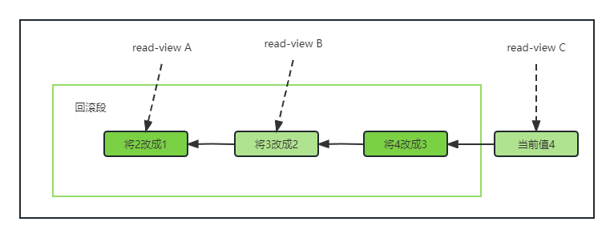
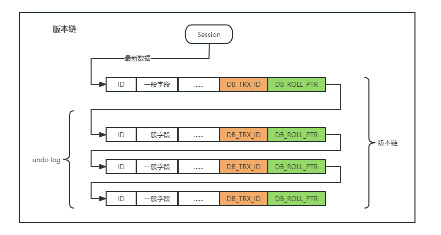

## 03|事务隔离：为什么你改了我还看不见

简单来说，事务就是要保证一组数据库操作，要么全部成功，要么全部失败。在MySQL中，事务支持是在引擎层实现的，不是所有引擎都支持事务。例如MyISAM不支持事务，InnoDB支持。

事务的四个特性：ACID，原子性Atomicity，一致性Consistency，隔离性Isolation，持久性Duration。


### 隔离性和隔离级别

> 当数据库有多个事务执行的时候，就可能出现脏读（dirty read）、不可重复读（non-repeatable read）、幻读（phantom read）的问题，为解决这些问题，就有了“隔离级别”

SQL标准的四个隔离级别为：读未提交（read uncommited），读已提交（read commited），可重复读（repeatable read）和串行化（serializable）

- 读未提交：一个事务还没提交，做的变更能被其他事务看到；
- 读已提交：一个事务提交后，做的变更才能被其他事务看到；
- 可重复读：一个事务执行过程中看到的数据，总是跟这个事务在启动时看到的数据是一致的；
- 串行化：同一行记录，读写均加锁，只有当另一个事务执行完成后，下一个才会继续执行。

| 事务A                 | 事务B       |
| --------------------- | ----------- |
| 启动事务，查询得到值1 | 启动事务    |
|                       | 查询得到值1 |
|                       | 将1改成2    |
| 查询得到值V1          |             |
|                       | 提交事务B   |
| 查询得到值V2          |             |
| 提交事务A             |             |
| 查询得到值V3          |             |

- 读未提交：V1=V2=V3=2；
- 读已提交：V1=1；V2=V3=2；
- 可重复读：V1=V2=1；V3=2；
- 串行化：V1=V2=1；V3=2；

其中”读已提交”和“可重复读”都是通过read-view视图来实现的，“读未提交”无此视图，“串行化”为直接加锁的方法来实现。Oracle默认为“读已提交”，MySQL默认为“可重复读”这个要注意一下。（参数为`transaction-isolation`）


### 事务隔离的实现

> 这里主要是展开讲“可重复读”，主要实现是由MVCC

在MySQL中，实际上每条记录在更新的时候都会同时记录一条回滚操作。记录上最新值，通过回滚操作，都可以得到前一个状态的值。

假设一个值从1被按顺序改成了2、3、4，在回滚日志里面就会由类似下面的记录。



当前值是4，查询这条记录的时候，不同时刻启动的事务会有不同的read-view。在视图A、B、C中，这个记录的值分别是1、2、4，同一条记录记录在系统中可以存在多个版本，就是数据库的多版本并发控制（MVCC）。对于read-view A，要得到1，就必须将当前值依次执行图中的回滚操作得到。

问：**回滚日志不会一直保留，什么时候删除？**

答：系统会判断，当没有事务再需要用到这些回滚日志的时候，回滚日志会被删除。即：就是当系统里没有比这个回滚日志更早的read-view了的时候。没有其他事务还在使用当前版本的undo的时候，purge进行进行回收。

**建议尽量不要使用长事务**，长事务意味着系统里会存在很老的事务视图，事务提交之前，数据库里面它可能用到的回滚记录都必须保留，导致大量战用存储空间；另外还有长时间占用锁资源的问题，可能拖垮整个库。


### 事务的启动方式

1. 显示启动：begin 或者 start transaction。配套 commit，rollback；
2. set autocommit=0；自动开启，持续到commit，rollback，或者断开连接。

通常建议set autocommit=1，显示启动事务。连续启动事务可以使用 commit work and chain，表示提交事务并自动开启下一个事务，这样省去了再次执行begin的开销，有点像`ctrl+s`阶段性保存一下，继续写。

可以再infomation_schema库抵得innodb_trx表中查询长事务（主要依据自身需要来定义），比如：

```sql
-- 查询持续超过60s的事务
select * from information.schema.innodb_trx where TIME_TO_SEC(timediff(now(), trx_started))>60
```


### 总结

- 四种事务隔离级别；
- 读已提交和可重复读靠MVCC实现；
- 尽量避免长事务；


问：如何避免长事务？

答案：1. 监控；2. 配置最长执行挤时间参数：max_execution_time；


### TIPS

前提：InnoDB

快照读：即 select。执行方式生成read-view，直接利用MVCC机制来读取，不会对记录加锁；

当前读：读取的都是当前的最新版本，加锁防止其他事务修改数据，悲观锁，select ... lock in share mode/ for update (读锁/读写锁)，Update，delete，Insert都是当前读。

**MVCC**

事务版本号trx_id：每次事务开启前都会从数据库获得一个自增的事务ID，可以判断出事务开始执行时间的先后顺序；

表的隐藏列：每个表都有3个隐藏列，分别为：

- DB_TRX_ID：当前操作该数据的事务ID；
- DB_ROLL_PTR：指向上一个版本数据在undo_log的位置；
- DB_ROW_ID：隐藏ID，当创建表没有合适的聚集索引，会用该ID创建聚集索引。

undo log用途：用于rollback恢复数据；用于当前读；



read_view：MySQL在每个事务开启（第一个select时）后会生成一个read_view，主要保存了当前数据库中正处于活跃状态(未commit)的事务的ID号。其有几个重要属性：

- trx_ids：当前活跃事务ID号集合；
- low_limit_id：创建当前read_view时，“当前最大事务ID号+1”；
- up_limit_id：创建当前read_view时，“当前活跃事务最小ID号”；
- creator_trx_id：创建当前read_view时的事务ID号。

read_view匹配条件，当查询到某一行数据：

1. **数据事务ID <  up_limit_id 则显示**。即如果该数据当前的事务ID小于read_view中记录的最小的事务ID，表示该数据是在当前事务之前就为当前状态了，所以数据可以显示；
2. **数据事务ID >= low_limit_id 则不显示**：即如果该数据当前的事务ID大于等于read_view中记录的最大的事务ID+1，则表示该数据在read_view创建之后才为当前状态的，所以数据不显示；
3. **up_limit_id  <= 数据事务ID < up_limit_id，则需要与活跃事务集合trx_ids里进行匹配**：即说明在该数据在当前事务开始时，可能还未提交。
   - 如果数据事务ID不在read_view 的 trx_ids集合里，说明在read_view生成的时候事务已经提交了，这种情况的数据时可以显示的；
   - 如果数据事务ID在read_view 的 trx_ids集合里，说明在read_view生成的时候事务未提交，如果数据事务ID等等于creator_trx_id，则表示为自己操作生成，则可以显示；反之，则不能显示。
4. **当事务ID不满足read_view条件时，从undo log中获取数据**：从undo中获取历史版本，再根据 1，2，3 进行判断，直到找到满足的数据，或找不到，返回空。

【注】要考虑 select为快照读，delete，update，insert为当前读。


