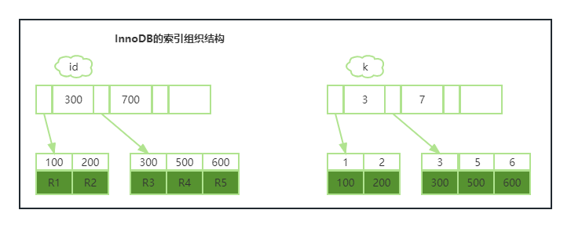

## 04|深入浅出（上）

> 索引的出现其实就是为了提高数据查询效率，就像书的目录一样。


### 索引的常见模型

三种常见：**哈希表**、**有序数组**、**搜索树**

#### 哈希表

> 一种key-value存储数据的结构，思路为把值放再数组里，用一个哈希函数把key换算成一个确定的位置，然后把value放在数组的这个位置。

多个key值经过哈希函数的换算会出现同一个值的情况。处理这种情况的一种方法是，拉出一个链表。


图中User2和User4根据身份中号hash计算出来的key都是N，后面跟的是一个链表。步骤为：ID_card_n2 Hash计算出N，桉顺序遍历，找到User2。

特点：新增User速度非常快，但缺点是不是有序的，做范围查询时查询速度很慢。

适用场景：只有等值查询的场景，比如 Memcached和其他一些NoSQL引擎。

#### 有序数组

有序数组再等值查询和范围查询场景中的性能都非常优秀。


假设身份证号没有重复，这个数组就是按照顺序保存的，要查User2的名字，根据ID_card_n2，使用二分法就可以快速得到，这个时候的时间复杂度是O(log(N))。

但是更新数据就比较麻烦，往中间插一个数据就必须得挪动后面所有得记录，成本太高。

适用场景：只适用于静态存储引擎。比如保存2017年某个城市所有人口信息，这类不会再修改得数据。

#### 搜索树

二叉搜索树


特点：父节点左子树所有节点得值小于父节点得值。时间复杂度是O(log(N))。为了保证查询复杂度为O(log(N))，需要保持这棵树是平衡二叉树。为了这个保证，更新的时间复杂度也是O(log(N))。

由于索引不仅存于内存，还存在磁盘上，为了让一个查询尽量少读磁盘，就必须让查询访问尽量少的数据块。那么就要使用“N叉树”，这个N取决于数据块的大小。

以InnoDB的一个整数字段索引为例，这个N差不多是1200。这棵树高是4的时候，就可以存1200的3次方个值，着已经是17亿了。考虑到树根的数据块总是在内存中考虑到树根的数据块总是在内存中，一个10亿行的表上一个整数字段的索引，查找一个值最多只要访问3次磁盘。其实树的第二层也有很大概率在内存中，那么平均次数就更少了。（MySQL中一个页默认16K，一个整数（bigint）字段索引长度为8B，另外每个索引还跟着6B的指向其子树的指针，所以 16K/14B约等于1170）。

在MySQL中，索引是在存储引擎层实现的，所以并没有统一的索引标准。


### InnoDB的索引模型

InnoDB中，表都是根据主键顺序以索引的形式存放的，这种存储方式的表称为索引组织表。InnoDB使用了B+树索引模型。每一个索引在InnoDB里面对应一颗B+树。

```Mysql
create table T(
	id int primary key,
    k int not null,
    name varchar(16),
    index (k)
)engine=InnoDB;
```

表中R1~R5的(id, k) 值分别为(100, 1)、(200, 2)、(500, 5) 和 (600, 6)，两棵树的示意图如下：



根据叶子节点的内容，索引类型分为主键索引和非主键索引。

主键索引的叶子节点存的是整行数据，也叫聚簇索引。非主键索引叶子节点的内容是主键的值，也称为二级索引。

在查询的时候，基于非主键索引的查询需要多扫描一颗索引树。因此，我们在英勇中应该尽量使用主键查询。

### 索引维护

B+树为了维护索引的有序性，在插入新值的时候，需要作必要的维护。期间会涉及到数据挪动或者页分裂，页合并等，性能会受到影响。

其中也分裂还会造成原来放在一个页的数据，分裂之后放在了两个页，造成空间浪费。

推荐自增主键，每插入一条新纪录都是追加操作，都不涉及到挪动其他记录，也不会触发叶子节点的分裂。业务逻辑的字段则不容易保证有序插入，这样读写数据的成本都相对较高。


### 小结

三种结构：hash表，顺序数组，搜索树

InnoDB采用B+树，主要是减少查询磁盘次数

建议使用自增主键


问题：重建普通索引和重建主键的做法，说说理解，如何不合适，更好的方法是什么？

答：重建普通索引是合理的，可以达到省空间的目的。重建主键的过程不合理，不管是删除主键还是创建主键，都会重建整个表。


