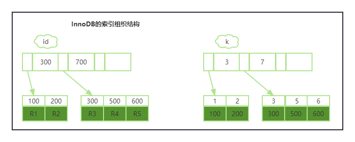
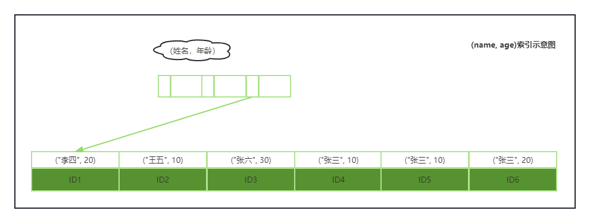

## 05|深入浅出索引（下）

```mysql
create table T (
	ID int primary key,
    k int NOT NULL DEFAULT 0,
    s vachar(16) NOT NULL DEFAULT '',
    index k(k)
)engin=InnoDB;
```

该表执行

```mysql
select * from T where k between 3 and 5;
```



执行流程如下：

1. 在k索引上找到k=3的记录，取得ID=300；
2. 再到ID索引树查到ID=300对应的R3；
3. 在k索引树取下一个值k=5，取得ID=500；
4. 再回到ID索引树查到ID=500对应的R4；
5. 在k索引树取下一个值k=6，不满足条件，循环结束。

> 回到主键索引树搜索的过程，叫回表。

上面这个语句回了两次表。


### 覆盖索引

> 减少树的搜索次数，显著提升查询性能。

如果执行的语句是

```mysql
select id from t where k between 3 and 5;
```

而id的值已经在k索引树上了，因此可以直接提供查询结果，不需要回表，这这里索引k已经覆盖了我们的查询需求，称为覆盖索引。

**讨论一个问题：在一个市民信息表上，是否有必要将身份证号和名字建立联合索引？**

假设市民表为：

```mysql
create table `tuser` (
	`id` int(11) NOT NULL,
    `id_card` varchar(32) DEFAULT NULL,
    `name` varchar(32) DEFAULT NULL,
    `age` int(11) DEFAULT NULL,
    `ismale` tinyint(1) DEFAULT NULL,
    PRIMARY KEY (`id`),
    KEY `id_card`(`id_card`),
    KEY `name_age`(`name`,`age`)
)engine=InnoDB;
```

根据身份证号查询市民信息，是否需要再创建（身份证号，姓名）的联合索引？

如果有个高频请求，要根据市民的身份证号查询他的姓名，这个索引的创建就有意义了。但实际上还是需要根据具体的情况来判断，因为创建这个索引不仅要使用到空间，还需要对索引进行维护。


### 最左前缀原则

> 如果为每一种查询请求都单独设计一个索引，索引就太多了，容易造成浪费。

B+树这种索引结构，可以利用索引的”最左前缀“，来定位记录。以(name, age)这个联合索引来分析



可以看到**索引项是按照索引定义里面出现的字段顺序排序的。**

如果要查的所有名字第一个字是”张“的人，`where name like '张%'`，这时，也能够用上这个索引，查找到第一个符合条件的记录是ID3，然后向后遍历，直到不满足条件为止。

**最左前缀可以是联合索引的最左N个字段，页可以是字符串索引的最左M个字符。**

在建立索引时，**如果可以通过调顺序，少维护一个索引，那该索引需要优先考虑；另外需要考虑的是空间。**


### 索引下推

```MYSQL
select * from tuser where name like '张%' and age=10 and ismale=1;
```

这个语句在搜索的时候，只能用到“张”，找到第一个满足条件的记录 ID3。之后：

- MySQL 5.6 之前，只能从ID3开始一个个回表；
- MySQL5.6引入索引下推优化，可以在遍历过程中，对索引中包含的字段先做判断，直接过滤掉不满足条件的记录，减少回表次数。


### 小结

- 覆盖索引
- 左前缀原则，前缀索引
- 索引下推


问题：以下建表语句

```mysql
create table `geek` (
	`a` int(11) not null,
    `b` int(11) not null,
    `c` int(11) not null,
    `d` int(11) not null,
    primary key (`a`,`b`),
    key `c`(`c`),
    key `ca`(`c`,`a`),
    key `cb`(`c`,`b` )
)engin=InnoDB;
```

有两个查询语句：

```mysql
select * from c=N order by a limit 1;
select * from c=N order by b limit 1;
```

为什么要创建`ca`,`cb`两个索引？是否都是必须的？为什么呢？

答：c字段创建了索引，最终叶子节点为(c, a, b)；ca上创建的索引，由于a是主键一部分，不会重复创建，所以还是(c, a, b)，故为多余的；创建cb索引，叶子节点为(c, b, a)。