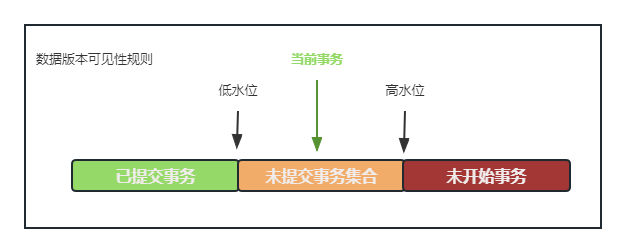

## 08|事务到底是隔离的还是不隔离的？

> 这一节主要是讲MVCC，03附中其实有做一些记录

```mysql
create table `t` (
	`id` int(11) not null,
    `k` int(11) default null,
    primary key (`id`)
) engine=InnoDB;
insert into t(id, k) values (1,1), (2,2);
```

| 事务A                                       | 事务B                                                        | 事务C                          |
| ------------------------------------------- | ------------------------------------------------------------ | ------------------------------ |
| start transaction with consistent snapshot; |                                                              |                                |
|                                             | start transaction with consistent snapshot;                  |                                |
|                                             |                                                              | update t set k=k+1 where id=1; |
|                                             | update t set k=k+1 where id=1;<br>select k from t where id=1; |                                |
| select k from t where id=1;<br>commit;      |                                                              |                                |
|                                             | commit;                                                      |                                |

begin/start  transaction 并不是一个事务的起点，之执行到他们之后的第一个操作InnoDB表的语句，事务才真正启动，如果想马上启动，需要使用

 ```mysql
start transaction with consistent snapshot;
 ```

read-view在执行第一个快照读语句时候创建；或者在执行`start transaction with consistent snapshot`时创建。默认autocommit=1。

A：k=1；B：k=3；


### ”快照“在MVCC里面是怎么工作的？

在可重复读隔离级别下，事务在启动的时候就“拍了个快照”。注意，这个快照是基于整库的。主要是保存了事务id，表示“以我启动的时刻为准，如果一个数据版本在我之前生成，就认，在启动之后，就不认，就找它上一个版本，找到为止（undo）”

在实现上InnoDB为每个事务构造了一个数组，用来保存这个事务启动瞬间，当前正在“活动”（启动还未提交）状态的所有事务ID；

- 低水位。数组里面事务ID的最小值；
- 高水位。当前系统里面已经创建过的事务ID的最大值+1；
- read-view：这个数组+高水位。

数据版本的可见性规则，是基于数据的row trx_id 和 read-view的对比结果得到的；

这个视图把所有的row trx_id分成了鸡中不同的情况。



对于当前事务的启动瞬间来说，一个诗句版本的row trx_id，有以下几种可能：

1. 落在绿色区域，表示数据事务之前已提交，数据可见；
2. 落在红色区域，表示这个版本由将来启动的事务生成，数据不可见；
3. 落在黄色不分，包括两种情况：
   - 若 row trx_id在数组中，表示这个版本是由未提交的事务生成的，不可见；
   - 若不在数组中，表示这个版本是已提交了的事务生成的，可见。

由此分析，假设前面那三条事务中，事务A执行之前，有一个活跃事务id为99，事务A为100，B为101，C为102；那么事务A视图数组为[99,100], 事务B[99,100,101], 事务C[99,100,101,102]。

B、C事务不在A的数组中，故其更新之后的数据，对于A为不可见；

为什么B读出为3：**更新数据都是先读后写的，而这个读，只能读当前的值，称为”当前读“。**

更新后的的trx_id为101。

select 加锁，也是当前读；

```mysql
select k from t where id=1 lock in share mode;
select k from t where id=1 for update;
```

可重复读的核心就是一致性读，而事务跟新数据的时候，只能用当前读。如果当前的记录行锁被其他事务占用的话，就需要进入锁等待。

读已提交和可重复读区别为：

- 可重复读只创建一次read-view，此后一直用这个不变；
- 读已提交，每一个语句执行前都会重新算出一个新的read-view。


### 小结

- 每个数据版本，都有自己的row trx_id
- 普通select 快照读，update为当前读之后再写；
- 

