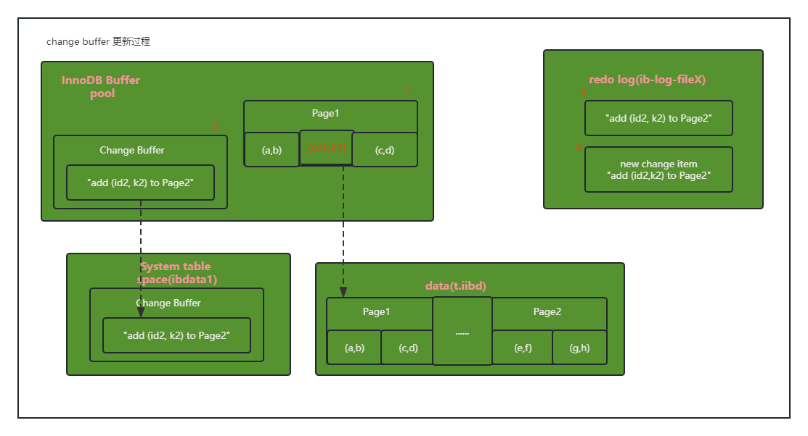

## 09|普通索引和唯一索引，应该怎么选择？

> 作者说前面的基础文章中，他给我介绍过索引的基本概念，相信我已经了解了唯一索引和普通索引的区别。我还是不太行，我不值得作者相信，因为我不记得作者讲过。

```mysql
select name from CUser where id_card='xxxxxxxxxxxxxxxxxx'
```

假设咱维护一个市民系统，每个认都有一个唯一的身份证号，像上面这样的SQL语句，会考虑在id_card上建索引。由于身份证号比较大，不建议作主键，那么只能选择唯一索引，或者普通索引。


假设字段k上的值都不重复。作者从两种索引对查询语句和更新语句的性能影响进行分析。


### 查询过程

假设执行

```MYSQL
select id from T where k=5;
```

下能通过B+树从树根开始，按层搜索叶子节点，然后数据页内部通过二分法来定位记录。

- 对于普通索引。查到满足条件的记录后，需要查找下一个记录，直到碰到第一个不满足条件记录为止。
- 对于唯一索引。由于定义了唯一性，查到第一个满足条件的记录后，就会停止继续检索。

性能差距：微乎其微。


### 更新过程

> 当更新一个数据页时，如果数据页在内存中就直接更新，如果这个数据也还没有在内存中的话，在不影响数据一致性的前提下，InnoDB会将这些更新操作缓存在change buffer中，这样就不需要从磁盘中读取这个数据页了，在下次查询需要访问这个数据页的时候，将数据读入内存，然后执行change buffer中与这个页有关的操作。这样来保持逻辑的正确性。
>
> change buffer在内存中有拷贝，页会被写入到磁盘上。

如果将更新操作先记录在change buffer上，减少读磁盘，语句的执行速度会得到明显提升。

对于唯一索引来说，所有的更新操作都要先判断这个操作是否违反唯一性约束，比如要插入（4，400）这个记录，要先判断表中是否已经存在k=4的记录，这个操作必须将数据页读入到内存才能判断，没有必要使用change buffer。故唯一索引不使用change buffer。

只有普通索引可以使用change buffer。InnoDB由`innodb_change_buffer_max_size`来动态设置。当设置为50的时候，表示，change buffer的大小最多能占buffer pool的50%。

对于插入（4，400）到表中，

第一种情况**这个记录要更新的目标页在内存中**：

- 唯一索引，找到3和5之间的位置，判断有没有冲突，插入这个值执，行结束；
- 普通索引，找到3和5之间的位置，插入这个值，执行结束。
- 提升不明显。

第二种情况**目标页不在内存中**：

- 唯一索引，找到3和5之间的位置，判断有没有冲突，插入这个值，执行结束；
- 普通索引，将更新记录在change buffer中，执行结束。
- 减少IO，更省成本。


### change buffer 的下使用场景

写多读少的业务来说，页面在写完以后马上被访问到的概率比较小，此时change buffer的使用效果最好。业务模型为：账单类，日志类。

反之，如果一个业务的更新模式是写入之后马上就要查询，将更新记录在change buffer之后，马上访问这条记录，触发merge过程。这样io不会减少，反正增加了维护change buffer的成本。


### 索引的选择和实践

建议尽量使用普通索引。

如果更新了马上使用场景比较多，建议关闭change buffer。


### change buffer 和 redo log

```mysql
insert into t(id, k) values (id1, k2), (id2, k2);
```

假设k1所在数据页在内存（buffer pool）中，k2所在的数据页不在内存中。



涉及四个部分：内存，redo，数据表空间，系统表空间。

1. Page 1在内存中，直接更新内存；
2. Page 2没有在内存中，就在内存的change buffer区域，记录下”我要往Page 2插入一行“这个信息；
3. 将上述两个动作计入redo log中。

做完上面这些，事务就可以提交了。其中写了两次内存，一处磁盘（两次操作何在一起顺序写磁盘）。

之后的读操作：

```MYSQL
select * from t where k in (k1, k2);
```


1. 读Page1 时，直接从内存返回。
2. 读Page2时，需要把Page2从此破案读入内存中，然后应用change buffer里面的操作日志，生成正确的版本返回结果。

- redo log 主要节省的是随机写磁盘的IO；
- change buffer主要节省的则是随机读磁盘的IO消耗。


### 小结

- 唯一索引用不上change buffer
- change buffer适合写多读少
- 优先考虑的普通索引
- redo log 节省写IO，change buffer减少读IO


问题：change buffer一开始是写内存的，如果这个时候掉电重启，会不会导致change buffer丢失？

答：不会丢失。在事务提交时，change buffer的操作记录ue记录到redo log里面，崩溃恢复的时候change buffer也能找回来。

附：merge 过程

1. 从磁盘读数据页到内存；
2. 从change buffer里找出这个数据页的changebuffer记录，依次应用得到新版本；
3. 写redo log。这个redo log包含了数据的变更和change buffer的变更。
4. merge结束。


