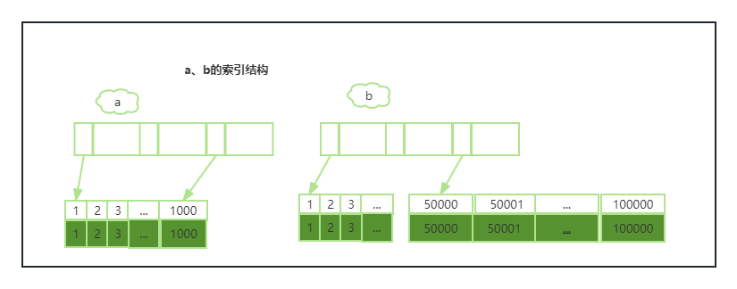

## 10|MySQL为什么有时候会选错索引？

走哪条索引是由MySQL来确定的。

```MSYQL
create table `t` (
	`id` int(11) not null auto_increment,
	`a` int(11) default null,
	`b` int(11) default null,
	primary key (`id`),
	key `a` (`a`),
	key `b` (`b`),
) engine=InnoDBl
```

往表t中插入10万行记录，按照整数递增即：(1,1,1),(2,2,2),(3,3,3),......,(100000,100000,100000)。

```mysql
select * from t where a between 10000 and 20000;
```

explain这条语句，会发现优化器选择了索引a。

现执行如下操作：

| SessionA                                    | SessionB                                                     |
| ------------------------------------------- | ------------------------------------------------------------ |
| start transaction with consistent snapshot; |                                                              |
|                                             | delete from t;<br>call idata(); -- 这里为插入10万数据的存储过程 |
|                                             |                                                              |
|                                             | explain select * from t where a between 10000 and 20000;     |
| commit;                                     |                                                              |

这个时候优化器不会再选择索引a了，explain发现走全表扫描，会出现慢查询。当我们使用 `force index(a)`的时候，强制走索引a，执行时间更短。说明索引a才是正确的。


### 优化器逻辑

优化器找到一个最优的执行方案，用法最小的代价取执行语句。在数据库中，扫描行数是影响执行代价的因素之一（还有是否涉及临时表，排序等）。扫描行数越少，意味着访问磁盘数据的次数越少，消耗的cpu资源越少。

MySQL开始执行之前，只能根据统计信息来估算记录数，这个统计信息就是索引的“区分度”。一个索引上不同的值越多，这个索引的区分度就越好。而索引上不同值的个数，我们称之为“基数”。

show index from t； 可以看到一个索引的基数。如果表中所有行都取出来统计，消耗太大，innoDB选择“采样统计”。InnoDB会默选择N个数据页，统计这些页面上的不通值，得到一个平均值，然后乘以这个索引的页面数，就得到这个索引的基数。更新频率为，当变更的数据行数超过1/M时，会触发重新做一次索引统计。

MySQL中，有两种存储索引统计的方式，可以通过设置参数`innodb_stats_persistent`的值来选择：

- 设置为on时，表示会持久化到存储。这时默认的N是20，M是10；
- 设置为off时，表示只会存储在内存，这时默认的N是8，M是16。

索引统计只是其中一个输入，对于具体语句来说，还需要判断语句本身要扫描多少行。

第二个执行的时候，扫描行数出现了较大偏差，这误导了优化器的判断。同时，优化器会把每次回表的代价也算在里面。优化器认为扫描10万行主键的代价比3万行索引代价更低的时候，就会选择扫主键。

既然是统计信息不对，那么修正就行了。`analyze table t`，可以用来重新统计索引信息。

看另一个查询语句：

```MYSQL
select * from t where (a between 1 and 1000) and (b between 50000 and 100000) order by b limit 1;
```



如果使用a，需要扫描1000行；如果使用b，需要扫描50001个值。但当我们explian执行之后发现，优化器选择了b。row字段显示需要扫描的行数是50198。

索引依然选错了。

- 因为order by b，优化器认为走索引b可以避免排序；
- 因为limit 1，优化器认为只要找到1条满足条件的记录。索引b可以提前终止；


### 索引选择异常处理

一种方法：使用 force index强行走一个索引，在某些情况可以起到矫正作用，但这种方法不敏捷。

另一种方法：修改语句，引导MySQL使用期望的索引。比如把上面order by b limit 1改为order by a, b limit 1 ,语句逻辑上是相同的。这样就避免了优化器认为使用b可以避免排序的情况。

第三种方法：创建一个更合适的索引，或者删掉误用的索引。


### 小结

- 索引可能选错
- 优化器的选择结果和扫描行数、排序、临时表使用等都有关系；
- 索引统计信息不准确可以使用analyze table 重新收集统计信息；
- force index 强制走索引
- 推荐修改语句、创建新/删除旧索引的方式来让优化器选择符合预期的执行方案；


