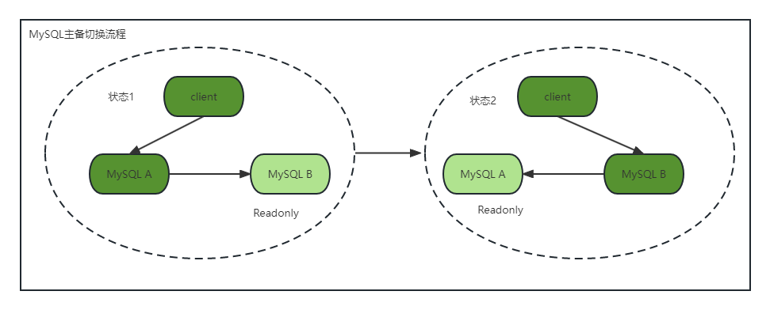

## 24|MySQL是怎么保证主从一致的？

binlog猛得一批，这章作者主要讲主从一致。

### MySQL主备的基本原理

这个图就是一般的主备切换流程，多的就不描述了，没啥意思；

readonly设置对超级用户权限无效（super），而用于同步更新的线程，就拥有超级权限。

以一个update语句为例

备库B跟主库A之间维持了一个长连接，主库A内部有一个线程，专门用于服务备库B这个长连接。

1. 在备库B上通过change master命令，设置主库A的IP、端口、用户名、密码、以及要从哪个为止开始请求binlog，这个位置包含文件名和日志偏移量；
2. 在备库B上执行start slave命令，这时备库会启动两个线程，io_thread和sql_thread。io_thread负责与主库建立连接；
3. 主库A校验完用户名、密码后，开始按照备库B传过来的位置，从本地读取binlog，发给B；
4. 备库B拿到binlog后，写到本地文件，relaylog；
5. sql_thread读取relaylog，解析出日志的命令，并执行。（后来由于多线程复制方案的引入，sql_thread演化成为多线程）

### binlog三种格式对比

binlog_format=statement，binlog里面记录的是SQL原文，这样做会导致主从看可能不一致的情况；

binlog_format=row，binlog记录的是操作的哪张表，对此表的哪行数据进行了什么样的操作，这不会出现主从不一致的情况；

### 为什么会有mixed格式binlog

1. 因为有些statement格式的binlog可能导致主备不一致，所以要使用row格式；
2. 但row格式的缺点是，很占空间，同时也消耗IO资源；
3. mixed格式的意思是，MySQL自己会判断这条SQL语句是否可能引起主备不一致，如果可能，就用row，否者就用statement。

不过一般都使用row，比如恢复数据。

### 循环复制问题

作者说，生产上使用比较多的是双M结构：

这样的情况下，MySQL A和B互为备库关系，会造成循环复制；怎么解决？

1. 两个库server id必须不同，如果相同，不能设定为主备关系；
2. 一个备库接到binlog并放再重放的过程中，生成原binlog的server id相同的新的binlog；
3. 每个备库在收到自己的主库发来的日志后，先判断server id是否与自己相同，表示这个日志是自己生成的，就直接丢弃这个日志；

### 小结

- 基本的主从结构
- io_thread，sql_thread，dump_thread啥时候工作；
- undo log-->data-->redolog prepare-->binlog-->relaylog-->data
- statement, row, mixed, 一般用row；
- server id不能相同，不能无法搭建双M

