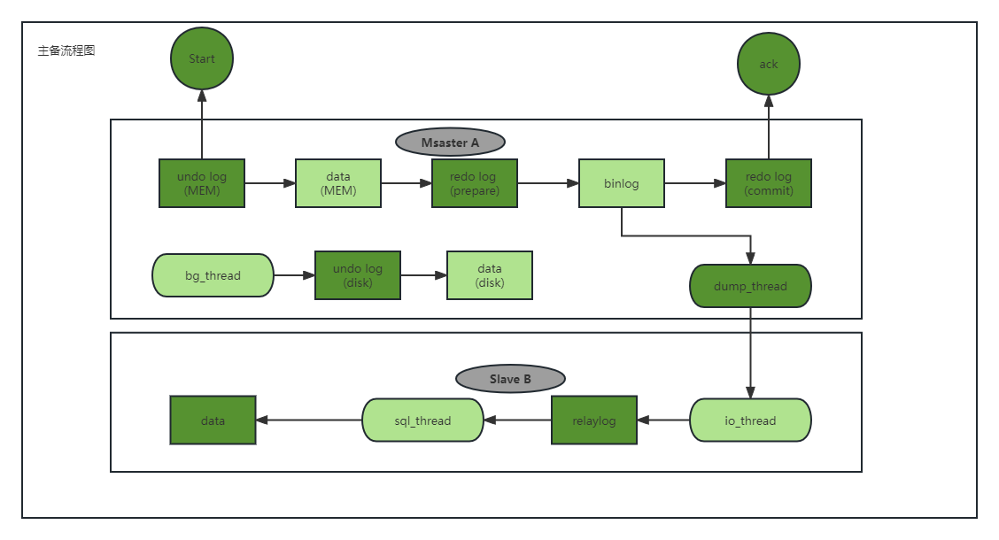

## 26|备库为什么会延迟好几个小时？

上一章讲了几种导致主从延迟的原因，正常情况下都可以追上来；但是如果备库执行日志的速度持续低于主库生成日志的速度，那这个延迟就有可能成了小时级别。而且对于一个压力持续比较高的主库来说，备库很可能永远追不上主库的节奏。

在主库上影响并发的的原因就是各种锁；而在备库上的执行，就是sql_thread更新数据的逻辑，如果是单线程的话，导致更新不够快，造成主备延迟、5.6之前只支持单线程。

这里，作者主要讲讲MySQL多线程复制的演进过程。

说到底，所有的多线程复制机制，都是要把只有一个线程的sql_thread，拆成多个线程。符合如下模型：

relay log --> coordinator --> worker_1 ... worker_n(n个并发) --> data 

coordinator 就是原来的sql_thread，只是不再直接更新数据了，只负责读取relaylog，然后分发事务、真正更新数据的，变成了worker线程，worker线程数是由slave_parallel_workers决定的。

coordinator在分发的时候，需要满足两个基本要求：

1. 不能造成更新覆盖，这就要求更新同一行的两个事务，必须分发到同一个worker中。
2. 同一个事务不能被拆开，必须放到同一个worker中。

各个版本的多线程复制，基本上都遵循这两个基本原则。

### MySQL 5.5 版本的并行复制策略

5.6之前其实没有，这两个是作者自己搞的。

#### 按表分发策略

基本思路：如果两个事务更新不同的表，他们就可以并行。

当然如果跨表的事务，还是要把两张表放再一起考虑。

每个worker线程对应一个hash表，用于保存当前正在这个worker的“执行队列”里的事务所涉及的表。hash表的key是“库名.表明”，value是一个数字，表示队列有多少个事务修改这个表。

这种方法，如果遇到热点表，就变成单线程复制了。

#### 按行分发策略

为解决热点表问题，就需要一个按行并行负责的方案。

核心思路是：如果两个事务没有更新相同的行，它们在备库上可以并行执行。这个模式要求binlog格式必须是row。

复制的的数据结构也是为每个worker，分配一个hash表。key必须是“库名+表名+唯一键值”

相比于按表并行分发策略，按行并行策略在决定线程分发的时候，需要消耗更多的计算资源。

二者都有一些约束条件：

1. 要能够从binlog里面解析出表名，主键值和唯一索引的值，主库binlog格式必须是row；
2. 表必须有主键；
3. 不能有外键。

按行并行度更高，但有两个问题：

1. 耗费内存；
2. 耗费CPU。

### MySQL 5.6 版本的并行复制策略

官方5.6，支持了并行复制，粒度为按库并行。这个hash表里，key就是数据库名。

对比上面作者自己搞的两个，优势：

1. 构造hash值快，只需要库名；一个实例上DB数也不会很多；
2. 不要求binlog格式；因为都可以拿到库名。

但要是主要的table都放在一个db里面，那这个就没啥效果了。

### MariaDB的并行复制策略

redo log组提交优化：

1. 能够在同一组里提交的事务，一定不会修改同一行；
2. 主库上可以并行执行的事务，备库上也一定是可以并行执行的。

在实现上：

1. 在一组里面提交的事务，有一个相同的commit_id，下一组就是commit_id+1；
2. commit_id直接写到binlog里面；
3. 传到备库的时候，相同commit_id的事务分发到多个worker执行；
4. 这一组全部执行完成之后，coordinator再去取下一批；

这个方案没有完全模拟主库的情况，主库在commit的时候，下一组已经在执行了；而备库是一组执行完了，才开始下一组，吞吐量可能不够；同时这个方案容易被大事务拖后腿。

### MySQL 5.7 的并行策略

由参数slave-parallel-type来控制并行复制策略：

1. 配置为DATABASE，表示使用MySQL 5.6版本按库并行策略；
2. 配置为LOGICAL_CLOCK，表示的就是类似MariaDB的策略。不过它针对并行度做了优化。

MySQL5.7并行复制的思想是：

1. 同时处于prepare状态的事务，在备库执行时是可以并行的；
2. 处于prepare状态的事务，与处于commit状态的事务之间，在备库上也是可以并行执行的；

#### MySQL 5.7.22的并行复制策略

基于WRITESET的并行负责，新增一个参数binlog-transaction-dependency-tracking，用来控制是否用该新策略。

1. COMMIT_ORDER，表示同时进入prepare和commit来判断是u否并行的策略；
2. WRITESET，表示的是对于事务涉及更新的每一行，计算出这一行的hash值，组成集合writeset。如果两个事务没有操作相同的行，也就是writeset没有交集，就可以并行；
3. WRITESET_SESSION，实在WRITESET的基本上多一个约束，在主库上同一个线程先后执行的两个事务，在备库执行的时候，要保证相同的先后顺序。

为了唯一标识，这个hash值是通过”库名+表名+索引名+值“计算出来的，MySQL官方对比作者自己搞的按行策略有很大优势：

1. writeset实在主库生成后直接写入到binlog里面的，在备库执行的时候，不需要解析binlog内容，节省了很多计算量；
2. 不需要把整个事务的binlog都扫一遍才能决定分发到哪个worker，更省内存；
3. 分发不依赖binlog内容，statement格式也是可以的；

对于表上没有主键和有外键约束的场景，也是不行的。

### 小结

- 两个基本要求
- 核心是构造hash
- mariadb 使用的是commit_id的方式分组来搞

