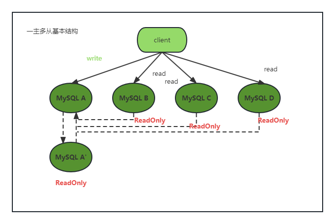

## 27|主库出问题了，从库怎么办？

作者之前一直讲的是，一主一备的基础情况，这一章开始讲一讲一主多从的情况



A和A'互为主备，B、C、D指向A。一主多从设置，一般用于读写分离；

假设A出现故障，A' 成为新的主库，从库B、C、D也要连接到A'。这样切换过程复杂性增加了；


### 基于位点的主备切换

当要把节点B设置成A'节点从库的时候，需要执行一条change master 命令：

```mysql
change master to
master_host=$host_name
master_port=$port
master_user=$user_name
master_password=$password
master_log_file=$master_log_name
master_log_pos=$master_log_pos
```

- master_host、master_port、master_user、master_password 表示主库A‘ 的IP、端口、用户名、密码；
- master_log_file、master_log_pos 表示要从主库的master_log_name文件的master_log_pos 这个位置的日志继续同步。这个位置就是同步位点。

A和A'的位点是不同的，从库B要切换的时候，需要找同步位点，但这个点很难被精确取到，只能取大概的位置。

一种取同步位点方法：

1. 等待A'把relay log全部同步完成；
2. A'上执行show master status，得到A’上最新的FIle和Position；
3. 取原主库A故障的时刻T；
4. 用mysqlbinlog工具解析A'的File，得到T时刻的位点

```mysql
mysqlbinlog File --stop-datetime=T --start-datetime=T
```

通常情况下，我们在切换任务的时候，要先主动跳出这些错误：

1. 主动跳过一个事务；遇到一个错误跳一次，或者跳过所有错误；
2. 通过设置slave_skip_errors参数，直接设置跳过指定的错误；比如设置为'1032,1062'，这样中间碰到这两个错误时就直接跳过；

这种情况背景是，我们清楚这个主备切换过程中直接跳过这些是无损的；


### GTID

MySQL 5.6版本引入GTID的方法来解决跳过错误那种比较麻烦的问题；

GTID。Global Transaction Identifier，全局事务ID，是事务的唯一标识。格式是`GTID=server_uuid;gno`

- server_uuid是一个实例第一次启动时生成的，是一个全局唯一的值；
- gno是一个整数，初始值是1，每次提交事务的时候分配给这个事务，并加1。

GTID模式开启，启动时加上参数gtid=on和enforce_gtid_consistency=on；

每个MySQL实例都维护了一个GTID集合，对应这个实例上执行的所有事务；


### 基于GTID的主备切换

```mysql
change master to
master_host=$host_name
master_port=$port
master_user=$user_name
master_password=$password
master_auto_position=1
```

master_auto_position=1表示使用GTID协议。假设A’ 的GTID合集为set_a，B 的GTID合集为set_b，在实例B上执行start slave执行的逻辑是：

1. 指定主库为A‘；
2. 实例B把set_b发给A’；
3. A'计算出set_a和set_b的差集，判断A‘是否已经把B需要的binlog给删了；a、删了，返回错误；确认包含，找出第一个不在set_b的事务，发给B；
4. 从这个事务开始，往后读binlog文件发给B去执行


### GTID和在线DDL

之前那种双向同步的模式中，使用了GTID就不用停止binlog了，直接X stop slave -->Y ddl --> 查出Y DDL 的gtid --> X start slave；

反过来，Y也同样。


### 小结

- 基于位点，麻烦
- 基于GTID 容易一些
- GTID 需要都使用支持事务的引擎，点位支持的引擎多