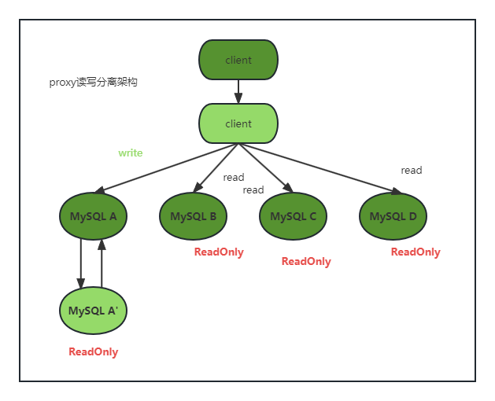

## 28|读写分离有那些坑？


读写分离的主要目标就是分摊主库压力。



proxy根据请求类型和上下文决定请求的分发路由。

1. 客户端直连方案，因为少了代理，所以查询性能稍好；但需要了解后端部署细节，在出现主从切换、迁移等情况，客户端都能感知到；
2. proxy架构，对客户端比较友好。客户端只需要关注业务，不需要关注后端细节；

作者说目前趋势是按照proxy架构去的；

今天作者要讨论的问题是：由于主从延迟，客户端执行完一个更新事务后马上发起查询，如果查询选择是从库的话，就有可能督导刚刚的事务更新之前的状态。作者称之为“过期读”。

处理方案有

- 强制走主库
- sleep 方案
- 判断主备无延迟方案
- 配合semi-sync方案
- 等主库位点方案
- 等GTID方案


### 强制走主库方案

查询分两类：

1. 对于必须拿到最新结果的请求，强制到主库上；
2. 对于可以读到旧数据的请求，才将其放到从库上。


### Sleep方案

主库更新后，读从库之前先sleep以下。类似于执行一条select sleep(1)命令。

这个方案是假设在大多数情况下主备延迟1s之内，作一个sleep大概率能拿到最新数据。

1. 查询请求本来只需要0.5s，但也会要等1s；
2. 如果延迟超1s，还是会出现过期读；


### 判断主备无延迟方案

三种做法：

1. show slave status中，seconds_behind_master的值；每次执行查询请求前，先判断这个值是不是等于0，必须等于0才能执行查询请求；
2. master_log_file和read_master_log_pos，表示读到主库的最新点位；relay_master_log_file和exec_master_log_pos表示备库执行的最新点位，如果这两组值完全相同，则表示日志以同步完成；
3. 对比GTID集合，确保主备无延迟；


### 配合semi-sync

semi-sync做了这样的设计：

1. 事务提交的时候，主库把binlog发给从库；
2. 从库收到binlog后，发回给主库一个ack，表示收到了；
3. 主库收到这个ack以后，才能给客户端返回事务完成；

如果启用了semi-sync，就表示至少有一个从库接收到了日志。

1. 查询在响应了ack的从库上，能够确保读到最新值；
2. 落到其他从库，还是有可能产生过期读；


### 等主库位点方案

```MYSQL
select master_pos_wait(file, pos[,timeout])
```

这条命令逻辑：

1. 从库上执行；
2. 参数file和pos指的是主库上的文件名和位置；
3. timeout可选，设置为正，表示这个函数最多等待几s。

这个命令正常返回结果是M正整数M，表示从命令开始执行，到应用完file和pos执行了多少事务；

1. 事务更新完成后，马上执行show master status得到当前主库的file和位点；
2. 选定一个从库执行查询语句；
3. 在从库上执行`select master_pos_wait(file, pos[,timeout])`
4. 如果返回值是>=0的正整数，则这个从库执行查询语句；
5. 否则到主库执行查询语句；


### GTID方案

```mysql
select wait_for_executed_gtid_set(gtid_set, 1)
```

这条命令逻辑是：

1. 等待，直到这个库执行的事务中包含传入的gtid_set，返回0；
2. 超时返回1

查询过程：

1. 事务更新完成后，从返回包直接获取GTID，记为gtid1；
2. 选定一个从库查询；
3. 在从库上执行`select wait_for_executed_gtid_set(gtid1, 1)`
4. 如果返回0，则在从库上执行；
5. 否则，去主库查询。


### 小结

- 一组多从，基本读写分离，带proxy的读写分离
- 需要最新数据的，强制走主库；能接受延迟的走备库
- 每次sleep几秒
- 对比位点file和pos来判断是否已经最新
- 配合半同步复制
- 根据主库位点，到备库查询是否已经最新
- 根据GTID，到备库查询是否已经最新