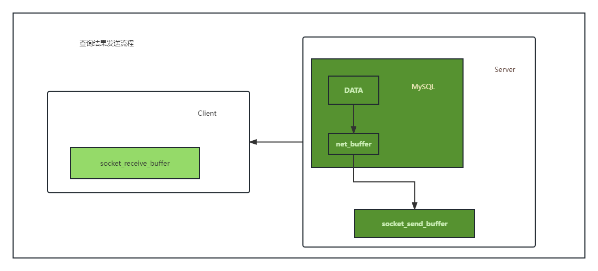

## 33|我查这么多数据，会不会把数据库内存打爆？

### 全表扫描对server的影响

实际上服务端并不需要保存一个完整的结果集，取数据和发数据的流程是这样的：

1. 获取一行，写到net_buffer。net_buffer_length决定，默认16k；
2. 重复获取行，直到net_buffer写满，调用网络接口发出去；
3. 如果发送成功清空net_buffer，然后继续取下一行写入net_buffer中；
4. 如果发送函数返回EAGAIN或者WSAEWOULDBLOCK，表示本地网络栈写满了，进入等待，直到网络栈重新科写，在继续发送。

1. 一个查询在发送过程中，占用MySQL内部内存大小就是net_buffer_length这么大；
2. socket send buffer 如果被写满，就会暂停读数据的流程（默认定义 /proc/sys/net/core/wmem_default）

也就是说MySQL是边写边发的。

对于正常的线上业务来说，如果一个查询的返回结果不会很多的话，建议直接把查询结果保存到本地内存。

sending to client状态，表示服务器短的网络栈写满了；

sending data：

- MySQL查询语句进入执行阶段后，首先把状态设置为 sending data；
- 然后发送执行结果的列相关的信息给客户端；
- 再继续执行语句的流程；
- 执行完成之后，把状态设置成空字符串；

sending data可能处于sql执行的任意阶段。它的意思是正在执行；

这里可知，查询返回大量数据的时候，是分段发送给客户端的，并不会把内存打包。

### 全表扫描对InnoDB的影响

> 内存的数据页在buffer pool中管理，WAL里buffer pool汽倒了加速更新的作用；buffer pool还有更重要作用，加速查询。

加速效果依赖于重要指标：内存命中率；

show engine innodb status命令中，可以查到当前bp的命中率。一般线上系统，内存命中率要在99%以上。

innodb buffer pool大小一般设置为物理内存的60%-80%，是由innodb_buffer_poll_size确定的；

如果一个buffer pool满了，又要从磁盘读入一个数据页，那肯定要淘汰掉一个旧数据页。管理算法是一个LRU。

为了保证业务一定的命中率，MySQL对LRU算法进行了改进：按照5：3分为young区和old区：新插入，到old区；处于old区，数据页存在时间超过1s，移动到链表头部，yound区；短于1s，位置不变；

1. 扫描过程中，需要新插入的数据页，都被放到old区域；
2. 一个数据页里面有多条记录，这个数据页会被访问多次，但由于是顺序扫描，第一次和最后一次相隔时间不超过1s，还是会保留到old区；
3. 再继续扫描后续的数据，之前的这个数据页之后也不会在被访问到，于是始终没有机会移动到链表头部（young区，很快就被淘汰出去。

### 小结

- 不会爆
- server使用net buffer发送，如果网络栈满了，就不发了
- innodb 使用变种LRU算法，5：3的比例区分yound区和old区，主要用old区来做这部分工作；

